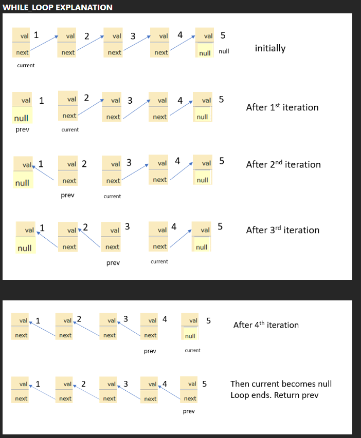
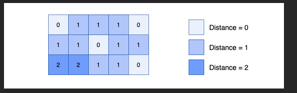
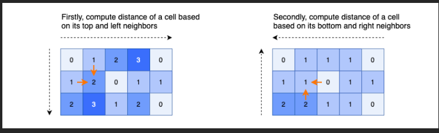

### 206. Reverse Linked List

https://github.com/VasiliyVelikyy/AlgoritmickTasks/blob/master/leet-code/src/easy/linked_list/ReverseLinkedList.java

### 542 542. 01 Matrix

> <https://leetcode.com/problems/01-matrix/description/>

> <https://github.com/VasiliyVelikyy/AlgoritmickTasks/blob/master/leet-code/src/main/java/medium/matrix/MatrixEval.java/>

Решение 1: BFS сначала на нулевых ячейках

Для удобства назовем ячейку со значением 0 нулевой ячейкой , ячейку со значением 1 — одноячейкой , расстояние до
ближайшего нуля ячейки — расстоянием .
Во-первых, мы видим, что расстояние всех нулевых ячеек равно 0.
Та же идея с сортировкой по топологии, сначала обрабатываем нулевые ячейки , затем используем queueструктуру данных для
сохранения порядка обработки ячеек, так что ячейки с меньшим расстоянием будут обработаны первыми. Затем мы расширяем
необработанных соседей текущей обрабатываемой ячейки и помещаем в нашу очередь.
В конце концов, мы можем добиться минимального расстояния между всеми ячейками нашей матрицы.

Решение 2: Динамическое программирование

Для удобства назовем ячейку со значением 0 нулевой ячейкой , ячейку со значением 1 — одноячейкой , расстояние до
ближайшего нуля ячейки — расстоянием .
Во-первых, мы видим, что расстояние всех нулевых ячеек равно 0, поэтому мы пропускаем нулевые ячейки , обрабатываем
только единичные ячейки .
В DP мы можем использовать только предыдущие значения, если они уже вычислены.
В этой задаче у ячейки есть максимум 4 соседа, которые находятся слева, сверху, справа, снизу. Если мы используем
динамическое программирование для вычисления расстояния текущей ячейки на основе 4 соседей одновременно, это невозможно,
поскольку мы не уверены, вычислено ли уже расстояние до соседних ячеек или нет.
Вот почему нам нужно вычислить расстояние по одному:
Во-первых, для ячейки мы ограничиваем ее только двумя направлениями: влево и вверх. Затем мы итерируем ячейки сверху
вниз и слева направо , мы вычисляем расстояние ячейки на основе ее левых и верхних соседей .
Во-вторых, для ячейки мы ограничиваем ее только двумя направлениями: вправо и вниз. Затем мы итерируем ячейки снизу
вверх и справа налево , мы обновляем расстояние ячейки на основе ее правых и нижних соседей .

