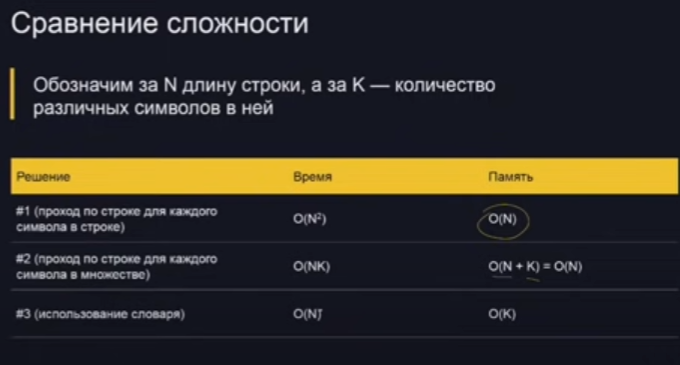

### Что такое сложность?

* Сложность алгоритма - порядок количества действий,
  которые выполняет алгоритм
* Например, в программе два вложенных цикла, каждый от 1 до N, тогда сложность составляет 0(2)
* 100°N = O(N), 2*N = O(N). Здесь 100 и 2 - константы,
  на зависящие от размера входных данных. Константы не так сильно влияют на скорость работы алгоритма при больших
  параметрах
  Еще бывает «пространственная сложность»
  использованной памяти
  — количество

##### Задача

Дана строка (в кодировке UTF-8)
Найти самый часто встречающийся в ней символ. Если несколько символов встречаются одинаково часто, то можно вывести
любой.

Переберем все позиции и для каждой позиции в строке еще раз переберем все позиции и в случае совпадения прибавим к
счетчику единицу. Найдем максимальное значение счетчика
a,b,a,b,a
^

Сложность O(N*N) так как 2 вложенных цикла. Первый перебирает количество символов, второй число вхождений

#### Решение #1

Переберем все позиции и для каждой позиции в строке еще раз переберем все позиции и в случае совпадения прибавим к
счетчику единицу. Найдем максимальное значение счетчика

```python
s = input()
ans =
anscnt = 0
for i in rahge(len(s)):
nowcnt = 0
    for j in range(len(s)): if s[i] == s[j]:
    nowcnt += 1
    if nowcnt > anscnt: ans = s[i]
        anscnt = nowcnt
print(ans)
```

#### Решение #2

Переберем все символы, встречающиеся в строке, а затем переберем все позиции и в случае совпадения прибавим к счетчику
единицу. Найдем максимальное значение счетчика

```python
s- input()
ans -
anscnt - 0
for now in set(s):
  nowcnt - 0
  for j in range(len(s)): if now - s[j]:
    nowcnt +- 1
  if nowcnt> anscnt:
  ans - now
  anscnt nowcnt
print(ans)
```

Сложность алгоритма O(N*K) или N*log(n)

#### Решение #3

Заведем словарь, где ключом является символ, а значением раз он встретился. Если символ встретился впервые элемент
словаря с ключом, совпадающем с этим символом и значением ноль. Прибавляем к элементу словаря с ключом, совпадающем с
этим символом, единицу
Сложность алгоритма O(N)

Особые случаи- нужно обработать пустую строку.
Или если задача на выбор максимума из последовательности, может прийти символ а не число

#### Советы по составлению тестов

* Если есть примеры — реши их руками и сверь ответ. Если не совпадает, то либо правильных ответов может быть несколько,
  либо ты неправильно понял задачу
* Сначала составь несколько примеров и реши задачу руками, чтобы лучше понять условие и чтобы потом было с чем сравнить
* Проверь последовательность из одного элемента и пустую
  последовательность
* «Краевые эффекты» - проверь, что программа работает корректно в начале и конце последовательности, сделай тесты, чтобы
  ответ находился на первом
  и на последнем месте в последовательности
* Составь покрытие всех ветвлений, так чтобы был тест, который входит в каждый if и else
* Подбери тесты чтобы не было ни одного входа в цикл
* Один тест - одна возможная ошибка




